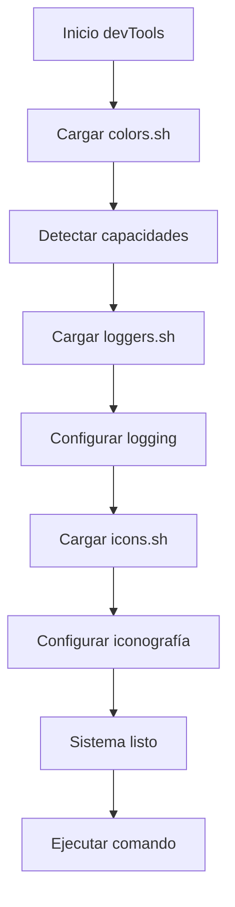

# 📚 Sistema de Librerías

El sistema de librerías de DevTools proporciona la infraestructura fundamental para toda la funcionalidad del proyecto. Estas librerías implementan patrones de diseño compartidos y ofrecen APIs consistentes que garantizan una experiencia cohesiva en toda la suite.

## 🏗️ Visión General de la Arquitectura

### 🎯 Principios de Diseño

1. **🔗 Modularidad**: Cada librería tiene responsabilidades específicas y bien definidas
2. **🔄 Reutilización**: Código común accesible desde cualquier componente del sistema
3. **🛡️ Robustez**: Manejo inteligente de errores y fallbacks para diferentes entornos
4. **⚡ Performance**: Optimización de carga y ejecución para respuesta rápida
5. **🎨 Consistencia**: APIs unificadas y patrones de uso estandarizados

### 📦 Arquitectura de Carga

```bash
# Orden de carga desde devTools principal
source "$LIB_DIR/colors.sh"      # 1. Base de colorización
source "$LIB_DIR/loggers.sh"     # 2. Sistema de logging (depende de colors)  
source "$LIB_DIR/icons.sh"       # 3. Iconografía (depende de colors)

# Inicialización automática
detect_color_support             # Configurar capacidades de color
configure_icons                  # Configurar iconografía del sistema
log_info "DevTools inicializado" # Primera entrada en el sistema de logs
```

## 📋 Inventario de Librerías

### 🌈 `colors.sh` - Sistema de Colores Inteligente

**📍 Ubicación**: `lib/colors.sh`

**🎯 Responsabilidad Principal**: Gestión inteligente de colores en terminal con detección automática de capacidades y fallbacks elegantes.

**🔑 Características Clave**:
- ✅ Detección automática de soporte de colores del terminal
- 🎨 Paleta completa con colores semánticos (success, error, warning, info)
- 🔄 Degradación elegante para terminales con capacidades limitadas
- 🌍 Soporte para temas claro/oscuro
- 📊 Utilidades especializadas (barras de progreso, separadores, tablas)

**🚀 API Principal**:
```bash
color_success "Operación exitosa"          # Verde semántico
color_error "Error crítico"                # Rojo de error
color_warning "Advertencia importante"     # Amarillo de advertencia
color_info "Información general"           # Azul informativo
color_progress_bar 75 100                  # Barra de progreso coloreada
debug_colors                               # Diagnóstico del sistema
```

**🔗 [Documentación Completa](../lib/colors.md)**

---

### 📝 `loggers.sh` - Sistema de Logging Estructurado

**📍 Ubicación**: `lib/loggers.sh`

**🎯 Responsabilidad Principal**: Infraestructura robusta para registro estructurado de eventos, métricas y debugging con múltiples niveles y formatos de salida.

**🔑 Características Clave**:
- 📊 Jerarquía completa de niveles (TRACE, DEBUG, INFO, WARN, ERROR, FATAL)
- 💾 Persistencia con rotación automática de archivos de log
- 🎨 Formateo inteligente con integración de colores
- 📈 Sistema de métricas cuantitativas integrado
- 🔍 Herramientas de búsqueda y análisis de logs

**🚀 API Principal**:
```bash
log_info "Sistema inicializado"            # Logging básico de información
log_operation "backup" "START"             # Tracking de operaciones críticas
log_metric "cpu_usage" "45.2" "percent"    # Métricas cuantitativas
log_command "npm install" $exit_code       # Logging de comandos ejecutados
generate_log_report                        # Reportes automáticos de actividad
```

**🔗 [Documentación Completa](../lib/loggers.md)**

---

### ✨ `icons.sh` - Sistema de Iconos Adaptativos

**📍 Ubicación**: `lib/icons.sh`

**🎯 Responsabilidad Principal**: Biblioteca completa de iconos Unicode/ASCII con detección automática de capacidades y fallback inteligente para máxima compatibilidad.

**🔑 Características Clave**:
- 🔍 Detección automática de capacidades Unicode, Emoji y Nerd Fonts
- 🎭 Biblioteca extensa de iconos semánticos y específicos por herramienta
- 🔄 Fallback automático e inteligente a representaciones ASCII
- 🛠️ Iconos especializados para herramientas de desarrollo (Docker, Node.js, Git)
- 🎨 Integración perfecta con el sistema de colores

**🚀 API Principal**:
```bash
icon_success                               # ✅ o [OK] según capacidades
status_indicator "running" "Docker"        # Combinación icono+color+mensaje
tool_status "node" "installed" "16.x"      # Estado visual de herramientas
progress_bar_with_icons 50 100            # Barras de progreso con iconografía
file_tree_item "/path/file.js" 2           # Elementos de árbol de archivos
```

**🔗 [Documentación Completa](../lib/icons.md)**

## 🔗 Matriz de Dependencias

### 📊 Relaciones Entre Librerías

| Librería | Depende de | Es utilizada por | Función Principal |
|----------|------------|------------------|-------------------|
| `colors.sh` | Sistema base | `loggers.sh`, `icons.sh`, comandos | Colorización base |
| `loggers.sh` | `colors.sh` | Todos los comandos, script principal | Logging estructurado |
| `icons.sh` | `colors.sh` | Comandos de interfaz, reportes | Iconografía visual |

### 🔄 Flujo de Inicialización



## 🛠️ Patrones de Integración

### 🎨 Patrón: Mensaje de Usuario Enriquecido

Combinación estándar de las tres librerías para interfaces ricas:

```bash
# Función helper que combina icono, color y logging
show_success() {
    local message="$1"
    local details="${2:-}"
    
    # Salida visual rica
    echo "$(color_success "$(icon_success) $message")"
    
    # Registro estructurado
    log_info "$message" "$details"
}

# Uso en comandos
show_success "Docker instalado correctamente" "version=20.10.7"
show_success "Dependencias actualizadas" "packages=15"
```

### 📊 Patrón: Progreso de Operación

Tracking completo con feedback visual y logging:

```bash
# Función integrada de progreso
track_operation() {
    local operation="$1"
    local current="$2"
    local total="$3"
    local details="${4:-}"
    
    # Log estructurado
    log_progress "$current" "$total" "$operation"
    
    # Display visual enriquecido
    echo "$(progress_bar_with_icons "$current" "$total" "$operation")"
    
    # Métrica cuantitativa
    local percentage=$((current * 100 / total))
    log_metric "${operation}_progress" "$percentage" "percent" "$details"
}

# Uso en instalaciones largas
track_operation "Instalando dependencias" 25 100 "manager=npm"
track_operation "Configurando entorno" 75 100 "stage=production"
```

### 🔧 Patrón: Verificación de Herramientas

Verificación y reporte visual consistente:

```bash
# Verificación integrada con feedback rico
check_tool() {
    local tool="$1"
    local version_cmd="${2:-$tool --version}"
    local required_version="${3:-}"
    
    log_debug "Verificando disponibilidad de $tool"
    
    if command -v "$tool" >/dev/null 2>&1; then
        local version=$($version_cmd 2>/dev/null | head -n1)
        
        # Mostrar estado visual
        echo "$(tool_status "$tool" "installed" "$version")"
        
        # Log estructurado
        log_info "$tool disponible" "version=$version"
        
        # Verificar versión si es requerida
        if [[ -n "$required_version" ]]; then
            version_check "$tool" "$version" "$required_version"
        fi
        
        return 0
    else
        # Herramienta no encontrada
        echo "$(tool_status "$tool" "missing")"
        log_warn "$tool no encontrado en PATH"
        return 1
    fi
}

# Uso en verificaciones
check_tool "docker" "docker --version" "20.0.0"
check_tool "node" "node --version" "16.0.0"
check_tool "git" "git --version"
```

## ⚙️ Configuración del Sistema de Librerías

### 🌍 Variables de Entorno Unificadas

```bash
# === CONFIGURACIÓN DE COLORES ===
export DEVTOOLS_NO_COLOR=false          # Deshabilitar todos los colores
export DEVTOOLS_THEME=dark              # Tema: dark|light|auto
export DEVTOOLS_COLOR_MODE=auto         # auto|256|basic|none

# === CONFIGURACIÓN DE LOGGING ===
export DEVTOOLS_LOG_LEVEL=2             # 0=TRACE, 1=DEBUG, 2=INFO, 3=WARN, 4=ERROR, 5=FATAL
export DEVTOOLS_LOG_FILE="$HOME/.devtools.log"
export DEVTOOLS_LOG_CONSOLE=true        # Mostrar logs en consola
export DEVTOOLS_LOG_FILE_ENABLED=true   # Escribir logs a archivo
export DEVTOOLS_LOG_MAX_SIZE=10485760   # Tamaño máximo antes de rotación (10MB)

# === CONFIGURACIÓN DE ICONOS ===
export DEVTOOLS_NO_UNICODE=false        # Deshabilitar caracteres Unicode
export DEVTOOLS_NO_EMOJI=false          # Deshabilitar emojis
export DEVTOOLS_NERD_FONTS=false        # Forzar uso de Nerd Fonts
export DEVTOOLS_ICON_THEME=default      # Tema: default|minimal|detailed|ascii
```

### 🔧 Perfiles de Configuración Predefinidos

#### 🎯 Perfil de Desarrollo

```bash
configure_development_profile() {
    export DEVTOOLS_LOG_LEVEL=1             # DEBUG level
    export DEVTOOLS_LOG_CONSOLE=true        # Verbose console output
    export DEVTOOLS_ICON_THEME=detailed     # Rich iconography
    export DEVTOOLS_THEME=dark              # Dark theme
    
    log_info "Configuración de desarrollo activada"
}
```

#### 🏭 Perfil de Producción

```bash
configure_production_profile() {
    export DEVTOOLS_LOG_LEVEL=3             # WARN level and above
    export DEVTOOLS_LOG_CONSOLE=false       # No console spam
    export DEVTOOLS_ICON_THEME=minimal      # Simple icons
    export DEVTOOLS_NO_COLOR=true           # No colors in logs
    
    log_info "Configuración de producción activada"
}
```

#### 🖥️ Perfil de Terminal Limitado

```bash
configure_basic_terminal_profile() {
    export DEVTOOLS_NO_COLOR=true           # ASCII only
    export DEVTOOLS_NO_UNICODE=true         # No Unicode characters
    export DEVTOOLS_ICON_THEME=ascii        # ASCII icons only
    export DEVTOOLS_LOG_CONSOLE=true        # Keep console output
    
    log_info "Configuración para terminal básico activada"
}
```

### 🚀 Inicialización Dinámica

```bash
# Función principal de inicialización del sistema de librerías
initialize_library_system() {
    local profile="${1:-auto}"
    local config_file="${2:-$HOME/.devtools.conf}"
    
    log_debug "Inicializando sistema de librerías" "profile=$profile"
    
    # Cargar configuración desde archivo si existe
    [[ -f "$config_file" ]] && source "$config_file"
    
    # Aplicar perfil específico
    case "$profile" in
        "development"|"dev")
            configure_development_profile
            ;;
        "production"|"prod")
            configure_production_profile
            ;;
        "minimal"|"basic")
            configure_basic_terminal_profile
            ;;
        "auto")
            # Detección automática del entorno
            if [[ "${CI:-}" == "true" ]] || [[ "${TERM:-}" == "dumb" ]]; then
                configure_production_profile
            elif [[ "${DEVTOOLS_ENV:-}" == "development" ]]; then
                configure_development_profile
            fi
            ;;
        *)
            log_warn "Perfil desconocido: $profile, usando configuración por defecto"
            ;;
    esac
    
    # Re-inicializar componentes con nueva configuración
    detect_color_support
    configure_icons "$DEVTOOLS_ICON_THEME"
    
    log_info "Sistema de librerías inicializado" "profile=$profile, capabilities=colors:$COLORS_ENABLED,unicode:$UNICODE_SUPPORT"
}
```

## 🧪 Testing y Validación

### 🔍 Suite de Pruebas Integrada

```bash
# Prueba exhaustiva del sistema completo de librerías
test_complete_library_system() {
    echo "$(color_title "$(icon_tool) TESTING COMPLETO DEL SISTEMA DE LIBRERÍAS")"
    echo
    
    local tests_passed=0
    local tests_failed=0
    local total_tests=0
    
    # Test de cada librería individual
    echo "$(color_subtitle "📚 Probando librerías individuales...")"
    
    # Colors.sh
    if test_color_functionality; then
        echo "$(status_indicator "success" "colors.sh: PASS")"
        ((tests_passed++))
    else
        echo "$(status_indicator "error" "colors.sh: FAIL")"
        ((tests_failed++))
    fi
    ((total_tests++))
    
    # Loggers.sh
    if test_logging_system; then
        echo "$(status_indicator "success" "loggers.sh: PASS")"
        ((tests_passed++))
    else
        echo "$(status_indicator "error" "loggers.sh: FAIL")"
        ((tests_failed++))
    fi
    ((total_tests++))
    
    # Icons.sh - Siempre pasa ya que es visual
    test_icon_system > /dev/null
    echo "$(status_indicator "success" "icons.sh: PASS (visual)")"
    ((tests_passed++))
    ((total_tests++))
    
    echo
    echo "$(color_subtitle "🔗 Probando integración entre librerías...")"
    
    # Test de integración: función que usa las tres librerías
    if test_integrated_message_display; then
        echo "$(status_indicator "success" "Integración de mensajes: PASS")"
        ((tests_passed++))
    else
        echo "$(status_indicator "error" "Integración de mensajes: FAIL")"
        ((tests_failed++))
    fi
    ((total_tests++))
    
    # Test de progreso integrado
    if test_integrated_progress_tracking; then
        echo "$(status_indicator "success" "Tracking de progreso: PASS")"
        ((tests_passed++))
    else
        echo "$(status_indicator "error" "Tracking de progreso: FAIL")"
        ((tests_failed++))
    fi
    ((total_tests++))
    
    echo
    echo "$(color_title "📊 RESUMEN DE PRUEBAS")"
    echo "$(status_indicator "info" "Total: $total_tests | Pasadas: $tests_passed | Falladas: $tests_failed")"
    
    if [[ "$tests_failed" -eq 0 ]]; then
        echo "$(status_indicator "success" "Todas las pruebas del sistema de librerías pasaron correctamente")"
        log_info "Suite de pruebas de librerías completada" "passed=$tests_passed, failed=$tests_failed"
        return 0
    else
        echo "$(status_indicator "error" "Algunas pruebas fallaron. Sistema puede tener problemas.")"
        log_error "Fallos en suite de pruebas de librerías" "passed=$tests_passed, failed=$tests_failed"
        return 1
    fi
}

# Test de integración: funciones que usan múltiples librerías
test_integrated_message_display() {
    local test_log="${LOG_FILE}.integration_test"
    local original_log="$LOG_FILE"
    LOG_FILE="$test_log"
    
    # Test mensaje de éxito integrado
    show_success "Test de integración" "test=message_display"
    
    # Verificar que se creó log y salida visual
    local result=true
    [[ -f "$test_log" ]] || result=false
    grep -q "Test de integración" "$test_log" 2>/dev/null || result=false
    
    # Cleanup
    rm -f "$test_log"
    LOG_FILE="$original_log"
    
    [[ "$result" == "true" ]]
}

test_integrated_progress_tracking() {
    local test_metrics="${LOG_FILE}.metrics.integration_test"
    local original_metrics="${LOG_FILE}.metrics"
    
    # Simular tracking de progreso
    for i in {1..5}; do
        track_operation "test_operation" "$i" 5 "integration_test=true"
    done
    
    # Verificar métricas generadas
    local result=true
    [[ -f "$test_metrics" ]] || result=false
    [[ $(wc -l < "$test_metrics" 2>/dev/null || echo 0) -eq 5 ]] || result=false
    
    # Cleanup
    rm -f "$test_metrics"
    
    [[ "$result" == "true" ]]
}
```

### 📊 Diagnóstico Completo

```bash
# Diagnóstico exhaustivo de todo el sistema de librerías
diagnose_complete_system() {
    echo "$(color_title "$(icon_info) DIAGNÓSTICO COMPLETO DEL SISTEMA DE LIBRERÍAS")"
    echo
    
    echo "$(color_subtitle "🖥️ Entorno del Terminal:")"
    echo "  TERM: $(color_info "${TERM:-no definido}")"
    echo "  LANG: $(color_info "${LANG:-no definido}")"
    echo "  COLORTERM: $(color_info "${COLORTERM:-no definido}")"
    echo "  Tamaño: $(color_info "$(tput cols 2>/dev/null || echo '?')x$(tput lines 2>/dev/null || echo '?')")"
    echo
    
    echo "$(color_subtitle "🎨 Sistema de Colores:")"
    echo "  Habilitados: $(color_info "$COLORS_ENABLED")"
    echo "  Soportados: $(color_info "$TERM_COLORS")"
    echo "  Tema: $(color_info "${DEVTOOLS_THEME:-auto}")"
    echo "  Modo: $(color_info "${DEVTOOLS_COLOR_MODE:-auto}")"
    echo
    
    echo "$(color_subtitle "📝 Sistema de Logging:")"
    echo "  Nivel: $(color_info "$LOG_LEVEL") ($(get_log_level_name $LOG_LEVEL))"
    echo "  Archivo: $(color_info "$LOG_FILE")"
    echo "  Consola: $(color_info "$LOG_TO_CONSOLE")"
    echo "  Archivo habilitado: $(color_info "$LOG_TO_FILE")"
    echo "  Tamaño máximo: $(color_info "$(format_bytes $LOG_MAX_SIZE)")"
    echo
    
    echo "$(color_subtitle "✨ Sistema de Iconos:")"
    echo "  Unicode: $(color_info "$UNICODE_SUPPORT")"
    echo "  Emoji: $(color_info "$EMOJI_SUPPORT")"
    echo "  Nerd Fonts: $(color_info "$NERD_FONTS_SUPPORT")"
    echo "  Tema: $(color_info "$ICON_THEME")"
    echo
    
    echo "$(color_subtitle "🔗 Estado de Integración:")"
    echo "  Librerías cargadas: $(color_info "colors.sh, loggers.sh, icons.sh")"
    echo "  Configuración: $(color_info "${DEVTOOLS_CONFIG_PROFILE:-auto}")"
    echo "  Inicialización: $(color_info "$(date)")"
    echo
    
    echo "$(color_subtitle "🧪 Prueba Visual Rápida:")"
    echo "  Estados: $(status_indicator "success" "OK") $(status_indicator "error" "Error") $(status_indicator "warning" "Advertencia")"
    echo "  Herramientas: $(tool_status "example" "installed" "1.0.0")"
    echo "  Progreso: $(progress_bar_with_icons 33 100 "Test")"
    echo
}

# Helper para obtener nombre del nivel de log
get_log_level_name() {
    case "$1" in
        0) echo "TRACE" ;;
        1) echo "DEBUG" ;;
        2) echo "INFO" ;;
        3) echo "WARN" ;;
        4) echo "ERROR" ;;
        5) echo "FATAL" ;;
        *) echo "UNKNOWN" ;;
    esac
}
```

## 🚀 Extensión del Sistema

### ➕ Agregar Nueva Librería

Para agregar una nueva librería al sistema:

```bash
# 1. Crear nueva librería en lib/nueva_lib.sh
# 2. Implementar funciones según patrones establecidos
# 3. Agregar carga en devTools principal:

source "$LIB_DIR/nueva_lib.sh"

# 4. Actualizar documentación y tests
# 5. Agregar a matriz de dependencias
```

### 🔧 Extender Funcionalidad Existente

```bash
# Ejemplo: Añadir nuevo color semántico
color_custom() {
    apply_color "95" "$1"  # Color personalizado
}

# Ejemplo: Añadir nuevo nivel de log
LOG_LEVEL_VERBOSE=-1
log_verbose() {
    _log "$LOG_LEVEL_VERBOSE" "VERBOSE" "$1" "${2:-}"
}

# Ejemplo: Añadir nuevo icono
icon_custom_tool() {
    if [[ "$EMOJI_SUPPORT" == "true" ]]; then
        echo "⚡"
    else
        echo "[TOOL]"
    fi
}
```

## 📚 Mejores Prácticas

### ✅ Recomendaciones

1. **🔗 Orden de Carga**: Siempre cargar colors.sh primero
2. **🎨 Consistencia Visual**: Usar funciones de combinación como `status_indicator`
3. **📝 Logging Estructurado**: Incluir contexto útil en todos los logs
4. **🔄 Testing**: Verificar funcionalidad en diferentes tipos de terminal
5. **⚡ Performance**: Evitar operaciones pesadas en loops de UI

### ❌ Anti-patrones

1. **🚫 Hard-coding**: Nunca usar códigos ANSI directamente
2. **🚫 Asumir Capacidades**: Siempre verificar soporte antes de usar
3. **🚫 Logs Excesivos**: Evitar logging en bucles intensivos
4. **🚫 Funciones Mixtas**: Mantener separación de responsabilidades
5. **🚫 Configuración Estática**: Usar variables de entorno para flexibilidad

---

> 💡 **Nota**: El sistema de librerías está diseñado para evolucionar. Nuevas funcionalidades deben seguir los patrones establecidos y mantener compatibilidad hacia atrás con configuraciones existentes.
