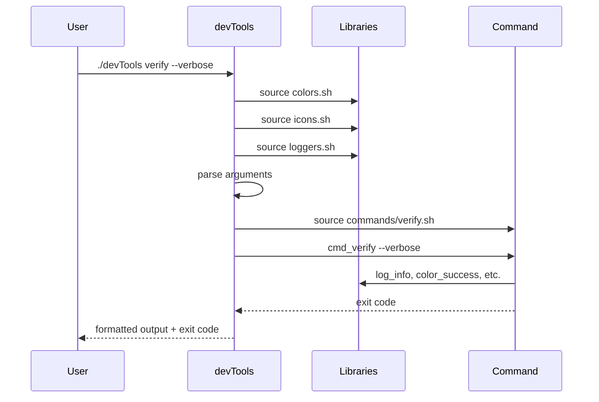

# 🎯 Script Principal (`devTools`)

El script principal `devTools` es el punto de entrada único de la suite. Su responsabilidad principal es coordinar la carga de librerías, procesar argumentos globales y delegar la ejecución a los comandos específicos.

## 📋 Archivo: `devTools`

### 🎯 Responsabilidades

1. **🔧 Inicialización**: Configuración inicial y detección de entorno
2. **📚 Carga de Librerías**: Importación de módulos compartidos
3. **⚙️ Procesamiento de Argumentos**: Análisis de comandos y opciones globales
4. **🎪 Delegación**: Transferencia de control al comando específico
5. **🚪 Finalización**: Manejo de códigos de salida y limpieza

### 📦 Estructura del Archivo

```bash
#!/bin/bash

# === CONFIGURACIÓN GLOBAL ===
set -euo pipefail                      # Modo estricto
SCRIPT_DIR="$(cd "$(dirname "${BASH_SOURCE[0]}")" && pwd)"
DEVTOOLS_VERSION="2.2.0"

# === CARGA DE LIBRERÍAS ===
source "$SCRIPT_DIR/lib/colors.sh"
source "$SCRIPT_DIR/lib/loggers.sh"
source "$SCRIPT_DIR/lib/icons.sh"

# === FUNCIÓN PRINCIPAL ===
main() {
    local command="${1:-help}"
    case "$command" in
        "verify"|"setup"|"clean"|"status"|"update"|"ports")
            delegate_to_command "$command" "${@:2}"
            ;;
        "help"|"--help"|"-h")
            show_help
            ;;
        "version"|"--version"|"-v")
            show_version
            ;;
        *)
            handle_unknown_command "$command"
            ;;
    esac
}

# === FUNCIONES DE APOYO ===
delegate_to_command() { ... }
show_help() { ... }
show_version() { ... }
handle_unknown_command() { ... }

# === PUNTO DE ENTRADA ===
main "$@"
```

## 🔧 Funciones Principales

### 🎯 Función `main()`

```bash
main() {
    local command="${1:-help}"
    
    case "$command" in
        "verify")
            source "$SCRIPT_DIR/commands/verify.sh"
            cmd_verify "${@:2}"
            ;;
        "setup")
            source "$SCRIPT_DIR/commands/setup.sh"
            cmd_setup "${@:2}"
            ;;
        "clean")
            source "$SCRIPT_DIR/commands/clean.sh"
            cmd_clean "${@:2}"
            ;;
        "status")
            source "$SCRIPT_DIR/commands/status.sh"
            cmd_status "${@:2}"
            ;;
        "update")
            source "$SCRIPT_DIR/commands/update.sh"
            cmd_update "${@:2}"
            ;;
        "ports")
            source "$SCRIPT_DIR/commands/ports.sh"
            cmd_ports "${@:2}"
            ;;
        "help"|"--help"|"-h")
            show_help
            ;;
        "version"|"--version"|"-v")
            show_version
            ;;
        *)
            log_error "Comando desconocido: $command"
            show_help
            exit 1
            ;;
    esac
}
```

**Características:**
- **Carga Lazy**: Los comandos se cargan solo cuando se necesitan
- **Paso de Argumentos**: `"${@:2}"` pasa todos los argumentos excepto el comando
- **Manejo de Errores**: Comando desconocido resulta en error y ayuda

### 🆘 Función `show_help()`

```bash
show_help() {
    echo "$(icon_logo) DevTools Suite v$DEVTOOLS_VERSION"
    echo
    echo "$(color_title 'COMANDOS DISPONIBLES:')"
    echo "  $(color_cmd 'verify')   $(icon_verify) Verificar proyecto y configuración"
    echo "  $(color_cmd 'setup')    $(icon_setup) Configurar entorno de desarrollo"
    echo "  $(color_cmd 'clean')    $(icon_clean) Limpiar archivos temporales"
    echo "  $(color_cmd 'status')   $(icon_status) Ver estado del sistema"
    echo "  $(color_cmd 'update')   $(icon_update) Actualizar dependencias"
    echo "  $(color_cmd 'ports')    $(icon_ports) Gestionar puertos y procesos"
    echo
    echo "$(color_title 'OPCIONES GLOBALES:')"
    echo "  $(color_opt '--help, -h')     Mostrar esta ayuda"
    echo "  $(color_opt '--version, -v')  Mostrar versión"
    echo
    echo "$(color_title 'EJEMPLOS:')"
    echo "  ./devTools verify --verbose"
    echo "  ./devTools setup --interactive"
    echo "  ./devTools clean --all"
    echo "  ./devTools ports --check 3000"
    echo
    echo "$(color_info 'Para ayuda específica: ./devTools <comando> --help')"
}
```

**Características:**
- **Interfaz Visual Rica**: Usa colores e iconos para mejor legibilidad
- **Información Contextual**: Ejemplos prácticos de uso
- **Navegación**: Enlaces a ayuda específica de comandos

### 🏷️ Función `show_version()`

```bash
show_version() {
    echo "DevTools Suite v$DEVTOOLS_VERSION"
}
```

## ⚙️ Configuración Global

### 🛡️ Modo Estricto de Bash

```bash
set -euo pipefail
```

- **`-e`**: Salir inmediatamente si un comando falla
- **`-u`**: Tratar variables no definidas como error
- **`-o pipefail`**: El pipe falla si cualquier comando falla

### 📁 Detección de Directorio

```bash
SCRIPT_DIR="$(cd "$(dirname "${BASH_SOURCE[0]}")" && pwd)"
```

- **`${BASH_SOURCE[0]}`**: Ruta del script actual
- **`dirname`**: Directorio padre del script
- **`cd && pwd`**: Ruta absoluta canónica

### 🏷️ Versionado

```bash
DEVTOOLS_VERSION="2.2.0"
```

- **Semantic Versioning**: MAJOR.MINOR.PATCH
- **Variable Global**: Accesible desde todos los módulos

## 📚 Carga de Librerías

### 🔄 Orden de Carga

```bash
# 1. Sistema de colores (base para todo)
source "$SCRIPT_DIR/lib/colors.sh"

# 2. Sistema de iconos (depende de detección de terminal)
source "$SCRIPT_DIR/lib/icons.sh"

# 3. Sistema de logging (usa colores e iconos)
source "$SCRIPT_DIR/lib/loggers.sh"
```

**Importancia del Orden:**
- `colors.sh` detecta capacidades del terminal
- `icons.sh` usa la detección de `colors.sh`
- `loggers.sh` utiliza funciones de ambos módulos anteriores

### 🔍 Verificación de Carga

```bash
# Verificar que las librerías se cargaron correctamente
if ! declare -f log_info > /dev/null 2>&1; then
    echo "ERROR: Failed to load logging library" >&2
    exit 1
fi
```

## 🎭 Delegación de Comandos

### 🏭 Patrón de Factory

```bash
delegate_to_command() {
    local command="$1"
    shift  # Remover el comando de los argumentos
    
    # Construir ruta del comando
    local command_file="$SCRIPT_DIR/commands/${command}.sh"
    
    # Verificar que existe
    if [[ ! -f "$command_file" ]]; then
        log_error "Comando no implementado: $command"
        return 1
    fi
    
    # Cargar y ejecutar
    source "$command_file"
    local func_name="cmd_${command}"
    
    if declare -f "$func_name" > /dev/null 2>&1; then
        "$func_name" "$@"
    else
        log_error "Función $func_name no encontrada en $command_file"
        return 1
    fi
}
```

### 🔄 Patrón de Ejecución

1. **Carga Dinámica**: `source` del archivo de comando
2. **Verificación**: Confirmar que la función existe
3. **Ejecución**: Llamar función con argumentos
4. **Propagación**: El código de salida se propaga automáticamente

## 🚨 Manejo de Errores

### 📋 Códigos de Salida

```bash
# Convención de códigos de salida
case $? in
    0) log_success "Comando completado exitosamente" ;;
    1) log_warning "Comando completado con advertencias" ;;
    2) log_error "Comando falló con errores" ;;
    3) log_critical "Error crítico en comando" ;;
    *) log_error "Código de salida inesperado: $?" ;;
esac
```

### 🛡️ Validación de Entrada

```bash
validate_arguments() {
    if [[ $# -eq 0 ]]; then
        show_help
        return 0
    fi
    
    local command="$1"
    case "$command" in
        verify|setup|clean|status|update|ports|help|version)
            return 0
            ;;
        --help|-h)
            show_help
            return 0
            ;;
        --version|-v)
            show_version
            return 0
            ;;
        *)
            log_error "Comando desconocido: $command"
            log_info "Use '$(color_cmd "./devTools --help")' para ver comandos disponibles"
            return 1
            ;;
    esac
}
```

## 🔧 Variables de Entorno

### 🌍 Variables Globales de DevTools

```bash
# Variables de configuración que afectan todo el sistema
DEVTOOLS_VERSION="2.2.0"           # Versión de la suite
DEVTOOLS_LOG_LEVEL="${DEVTOOLS_LOG_LEVEL:-INFO}"  # Nivel de logging
DEVTOOLS_NO_COLOR="${DEVTOOLS_NO_COLOR:-false}"   # Desactivar colores
DEVTOOLS_NO_ICONS="${DEVTOOLS_NO_ICONS:-false}"   # Desactivar iconos
```

### 📁 Variables de Contexto

```bash
# Variables que se establecen durante la ejecución
SCRIPT_DIR=""                       # Directorio del script
CURRENT_COMMAND=""                  # Comando actual en ejecución
COMMAND_START_TIME=""               # Timestamp de inicio
```

## 🔄 Flujo de Ejecución Completo



## 🧪 Testing y Debugging

### 🔍 Modo Debug

```bash
# Activar modo debug
export DEVTOOLS_LOG_LEVEL=DEBUG
./devTools verify

# Información de debugging
if [[ "${DEVTOOLS_DEBUG:-}" == "true" ]]; then
    log_debug "Script directory: $SCRIPT_DIR"
    log_debug "Command: $command"
    log_debug "Arguments: $*"
fi
```

### 🧪 Tests de Integración

```bash
# Test básico de funcionalidad
test_basic_functionality() {
    # Test help
    if ! ./devTools --help > /dev/null; then
        echo "FAIL: Help command failed"
        return 1
    fi
    
    # Test version  
    if ! ./devTools --version > /dev/null; then
        echo "FAIL: Version command failed"
        return 1
    fi
    
    echo "PASS: Basic functionality works"
}
```

---

> 💡 **Nota**: El script principal actúa como un dispatcher inteligente que mantiene la arquitectura modular mientras proporciona una interfaz unificada y coherente para todos los comandos.
