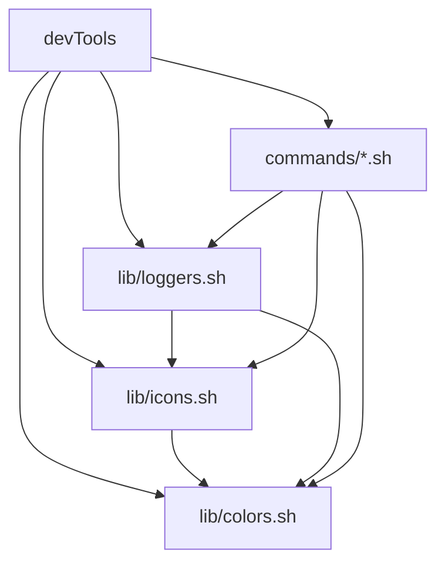

# 📋 Visión General de la Arquitectura

DevTools Suite está diseñado con una arquitectura modular que separa claramente las responsabilidades y facilita el mantenimiento, extensibilidad y testing del código.

## 🏗️ Principios de Diseño

### 🎯 Modularidad
- **Separación de Responsabilidades**: Cada módulo tiene una función específica
- **Bajo Acoplamiento**: Los módulos son independientes entre sí
- **Alta Cohesión**: Funcionalidades relacionadas están agrupadas

### 🔄 Reutilización
- **Librerías Compartidas**: Funcionalidades comunes centralizadas
- **Patrones Consistentes**: Interfaces uniformes entre módulos
- **Configuración Centralizada**: Variables y configuraciones unificadas

### 🚀 Escalabilidad
- **Carga Lazy**: Módulos cargados solo cuando se necesitan
- **Extensibilidad**: Fácil agregar nuevos comandos y funcionalidades
- **Performance**: Optimizado para ejecución rápida

## 📦 Estructura del Proyecto

```
scripts-devtools/
├── devTools                    # 🎯 Punto de entrada principal
├── lib/                        # 📚 Librerías compartidas
│   ├── colors.sh              # 🌈 Sistema de colores
│   ├── loggers.sh             # 📝 Sistema de logging
│   └── icons.sh               # 🎨 Gestión de iconos
├── commands/                   # ⚡ Implementación de comandos
│   ├── verify.sh              # 🔍 Verificación de proyectos
│   ├── setup.sh               # ⚙️ Configuración automática
│   ├── clean.sh               # 🧹 Limpieza del sistema
│   ├── status.sh              # 📊 Estado del sistema
│   ├── update.sh              # 🔄 Actualizaciones
│   └── ports.sh               # 🌐 Gestión de puertos
└── .docusaurus/               # 📚 Documentación
    └── docs/                  # 📄 Archivos markdown
        ├── intro.md           # 🏠 Introducción
        ├── architecture/      # 🏗️ Documentación de arquitectura
        ├── lib/              # 📚 Documentación de librerías
        └── commands/         # ⚡ Documentación de comandos
```

## 🔄 Flujo de Ejecución

### 1. Inicialización (`devTools`)
```bash
./devTools <comando> [argumentos]
```

1. **Carga de Librerías**: Se cargan `colors.sh`, `loggers.sh`, `icons.sh`
2. **Procesamiento de Argumentos**: Análisis de comando y opciones
3. **Delegación**: Se carga y ejecuta el comando específico
4. **Finalización**: Código de salida y limpieza

### 2. Carga de Librerías
```bash
# Orden de carga optimizado
source "$SCRIPT_DIR/lib/colors.sh"    # Primero: detección de terminal
source "$SCRIPT_DIR/lib/icons.sh"     # Segundo: iconos con fallback
source "$SCRIPT_DIR/lib/loggers.sh"   # Tercero: logging que usa colores e iconos
```

### 3. Ejecución de Comandos
```bash
# Patrón estándar para todos los comandos
source "$SCRIPT_DIR/commands/comando.sh"
cmd_comando "${@:2}"  # Pasar argumentos sin el nombre del comando
```

## 🎨 Patrones de Diseño

### 🏭 Factory Pattern (Comandos)
Cada comando implementa el mismo patrón:

```bash
cmd_comando() {
    # 1. Procesar argumentos
    # 2. Validar condiciones
    # 3. Ejecutar lógica principal
    # 4. Mostrar resumen
    # 5. Retornar código de salida
}
```

### 🎯 Strategy Pattern (Librerías)
Las librerías proporcionan estrategias intercambiables:

```bash
# Sistema de colores con estrategias adaptativas
detect_color_support()  # Detecta capacidades
apply_color()          # Aplica estrategia apropiada
```

### 🔧 Template Method (Logging)
Sistema de logging con template unificado:

```bash
_log() {
    # Template común para todos los niveles
    local level="$1"
    local message="$2"
    local icon="$3"
    local color_func="$4"
    
    # Procesamiento estándar
}
```

## 🔧 Interfaces y Contratos

### 📋 Interfaz de Comandos
Todos los comandos deben implementar:

```bash
# Función principal
cmd_<nombre>() {
    # Implementación del comando
}

# Función de ayuda
show_<nombre>_help() {
    # Ayuda específica del comando
}
```

### 📝 Interfaz de Logging
Sistema unificado de logging:

```bash
log_info()     # Información general
log_success()  # Operaciones exitosas
log_warning()  # Advertencias
log_error()    # Errores
log_debug()    # Información de debugging
```

### 🎨 Interfaz de UI
Elementos de interfaz consistentes:

```bash
icon_<tipo>()      # Iconos contextuales
color_<tipo>()     # Colores semánticos
log_section()      # Secciones de output
log_subsection()   # Subsecciones
```

## 🔄 Gestión de Dependencias

### 🏗️ Dependencias entre Módulos



### 📦 Carga Condicional
```bash
# Verificar si ya está cargado
if ! declare -f color_success > /dev/null 2>&1; then
    source "$(dirname "${BASH_SOURCE[0]}")/colors.sh"
fi
```

## 🔒 Gestión de Estado

### 🌍 Variables Globales
Variables de configuración centralizadas:

```bash
# Sistema de colores
COLORS_ENABLED=true
TERM_COLORS=0

# Sistema de iconos
ICONS_ENABLED=true
ICONS_UTF8=true

# Sistema de logging
LOG_LEVEL="INFO"
LOG_TO_FILE=""
```

### 💾 Estado Temporal
```bash
# Variables de proceso
LOG_PROGRESS_TASK=""
LOG_TIMER_START=""

# Variables de comando
PROJECT_TYPE=""
PACKAGE_MANAGER=""
```

## 🚨 Manejo de Errores

### 📋 Códigos de Salida Estandardizados
```bash
# 0: Éxito
# 1: Advertencias/problemas menores
# 2: Errores significativos
# 3: Errores críticos/fatales
```

### 🛡️ Validación de Entrada
```bash
# Validación de argumentos
while [[ $# -gt 0 ]]; do
    case $1 in
        --valid-option) ;;
        --help|-h) show_help; return 0 ;;
        *) log_error "Opción desconocida: $1"; return 1 ;;
    esac
done
```

### 🔧 Recuperación de Errores
```bash
# Operaciones con fallback
if ! comando_principal; then
    log_warning "Comando principal falló, intentando alternativa..."
    comando_alternativo || return 1
fi
```

## 📊 Métricas y Monitoring

### ⏱️ Medición de Performance
```bash
# Timer automático en comandos
log_timer_start "Operación compleja"
# ... operación ...
log_timer_end "success"
```

### 📈 Recolección de Métricas
```bash
# Estadísticas de uso
local files_processed=0
local errors_count=0
local warnings_count=0
```

## 🔄 Extensibilidad

### ➕ Agregar Nuevos Comandos
1. Crear `commands/nuevo-comando.sh`
2. Implementar `cmd_nuevo_comando()`
3. Agregar case en `devTools`
4. Crear documentación en `docs/commands/`

### 🎨 Personalizar Librerías
1. Extender funciones existentes
2. Agregar nuevos tipos de iconos/colores
3. Implementar nuevos levels de logging

### 🔧 Configuración Externa
```bash
# Archivo .devtools.json para configuración persistente
{
  "colors": { "theme": "dark" },
  "logging": { "level": "DEBUG" },
  "commands": { "verify": { "skip_tools": true } }
}
```

---

> 💡 **Nota**: Esta arquitectura modular permite que DevTools sea fácilmente mantenible, extensible y testeable, siguiendo las mejores prácticas de desarrollo de software.
